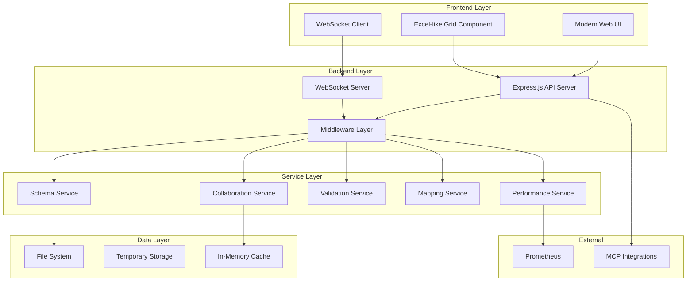
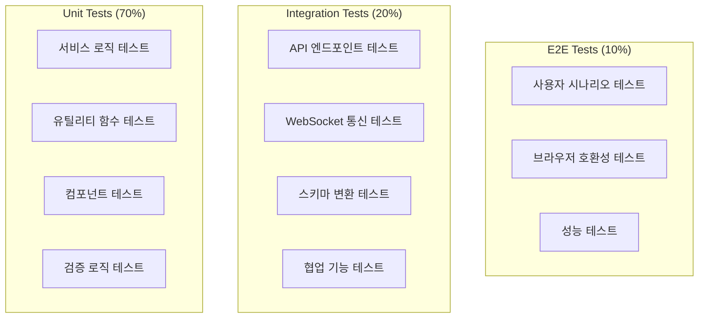

# 설계 문서

## 개요

EAI Schema Toolkit의 전면 리팩토링은 현재 시스템의 안정성과 성능을 유지하면서 현대적인 기술 스택으로 업그레이드하고, 사용자 경험을 크게 개선하는 것을 목표로 합니다. 특히 eai-work-tool.com과 같은 엑셀라이크 인터페이스 구현을 통해 사용자가 더 직관적으로 스키마를 편집할 수 있도록 합니다.

## 아키텍처

### 전체 시스템 아키텍처



### 패키지 업데이트 전략

현재 버전에서 최신 버전으로의 업그레이드 계획:

- **Node.js**: 18.x → 22.x LTS (2025년 현재 최신 LTS)
- **TypeScript**: 5.0.x → 5.7.x (최신 안정 버전)
- **Express.js**: 4.18.x → 5.1.x (새로운 기본 버전)
- **Jest**: 29.x → 30.x (최신 테스트 프레임워크)
- **ESLint**: 8.x → 9.x (최신 린팅 도구)
- **Socket.IO**: 4.8.x → 4.9.x (최신 WebSocket 라이브러리)

## 컴포넌트 및 인터페이스

### 1. 엑셀라이크 그리드 컴포넌트

연구 결과, 다음 라이브러리들이 적합한 것으로 확인되었습니다:

**선택된 솔루션: Handsontable Community Edition**
- 이유: 완전한 엑셀 경험, TypeScript 지원, React/Vue 통합 가능
- 대안: ReactGrid (React 전용), Luckysheet (오픈소스)

```typescript
interface GridComponentProps {
  data: SchemaGridData[][];
  columns: GridColumn[];
  onCellChange: (row: number, col: number, value: any) => void;
  onStructureChange: (changes: StructureChange[]) => void;
  readOnly?: boolean;
  collaborationMode?: boolean;
}

interface GridColumn {
  id: string;
  title: string;
  type: 'text' | 'number' | 'boolean' | 'date' | 'dropdown';
  validation?: ValidationRule[];
  width?: number;
}

interface SchemaGridData {
  fieldName: string;
  dataType: string;
  required: boolean;
  description: string;
  defaultValue?: any;
  constraints?: string;
}
```

### 2. 스키마 변환 엔진

```typescript
interface SchemaConverter {
  fromGrid(gridData: SchemaGridData[][]): Promise<ConversionResult>;
  toGrid(schema: string, format: SchemaFormat): Promise<SchemaGridData[][]>;
  validate(schema: string, format: SchemaFormat): Promise<ValidationResult>;
}

interface ConversionResult {
  xml?: string;
  json?: string;
  yaml?: string;
  errors: ConversionError[];
  warnings: ConversionWarning[];
}

enum SchemaFormat {
  XML = 'xml',
  JSON = 'json',
  YAML = 'yaml',
  XSD = 'xsd',
  WSDL = 'wsdl'
}
```

### 3. 실시간 협업 시스템

```typescript
interface CollaborationManager {
  joinSession(sessionId: string, userId: string): Promise<void>;
  leaveSession(sessionId: string, userId: string): Promise<void>;
  broadcastChange(sessionId: string, change: GridChange): Promise<void>;
  getActiveUsers(sessionId: string): Promise<ActiveUser[]>;
}

interface GridChange {
  type: 'cell-update' | 'row-insert' | 'row-delete' | 'column-insert' | 'column-delete';
  position: { row: number; col: number };
  oldValue?: any;
  newValue?: any;
  userId: string;
  timestamp: number;
}

interface ActiveUser {
  id: string;
  name: string;
  cursor?: { row: number; col: number };
  selection?: { startRow: number; startCol: number; endRow: number; endCol: number };
  color: string;
}
```

### 4. 현대화된 API 구조

```typescript
// RESTful API 설계
interface APIEndpoints {
  // 스키마 관리
  'POST /api/v2/schemas': CreateSchemaRequest;
  'GET /api/v2/schemas/:id': GetSchemaResponse;
  'PUT /api/v2/schemas/:id': UpdateSchemaRequest;
  'DELETE /api/v2/schemas/:id': DeleteSchemaResponse;
  
  // 그리드 데이터 관리
  'POST /api/v2/schemas/:id/grid': ConvertToGridRequest;
  'PUT /api/v2/schemas/:id/grid': UpdateGridRequest;
  'GET /api/v2/schemas/:id/export': ExportSchemaRequest;
  
  // 협업
  'POST /api/v2/collaboration/sessions': CreateSessionRequest;
  'GET /api/v2/collaboration/sessions/:id': GetSessionResponse;
  'WebSocket /api/v2/collaboration/sessions/:id/ws': CollaborationWebSocket;
}
```

## 데이터 모델

### 1. 스키마 데이터 모델

```typescript
interface Schema {
  id: string;
  name: string;
  description?: string;
  format: SchemaFormat;
  version: string;
  createdAt: Date;
  updatedAt: Date;
  createdBy: string;
  
  // 원본 스키마 데이터
  originalContent: string;
  
  // 그리드 표현
  gridData: SchemaGridData[][];
  gridMetadata: GridMetadata;
  
  // 협업 정보
  collaborationSession?: string;
  
  // 검증 결과
  lastValidation?: ValidationResult;
}

interface GridMetadata {
  columns: GridColumn[];
  rowCount: number;
  columnCount: number;
  customTypes: CustomDataType[];
  constraints: GlobalConstraint[];
}

interface CustomDataType {
  name: string;
  baseType: string;
  validation: ValidationRule[];
  displayFormat?: string;
}
```

### 2. 사용자 세션 모델

```typescript
interface UserSession {
  id: string;
  userId: string;
  schemaId: string;
  startTime: Date;
  lastActivity: Date;
  permissions: SessionPermission[];
  preferences: UserPreferences;
}

interface SessionPermission {
  action: 'read' | 'write' | 'delete' | 'share';
  granted: boolean;
}

interface UserPreferences {
  gridTheme: 'light' | 'dark' | 'auto';
  autoSave: boolean;
  autoSaveInterval: number; // seconds
  showGridLines: boolean;
  showRowNumbers: boolean;
  showColumnHeaders: boolean;
}
```

## 에러 처리

### 1. 계층화된 에러 처리

```typescript
// 에러 타입 정의
abstract class AppError extends Error {
  abstract readonly statusCode: number;
  abstract readonly isOperational: boolean;
  abstract readonly errorCode: string;
}

class ValidationError extends AppError {
  readonly statusCode = 400;
  readonly isOperational = true;
  readonly errorCode = 'VALIDATION_ERROR';
  
  constructor(
    message: string,
    public readonly field?: string,
    public readonly value?: any
  ) {
    super(message);
  }
}

class SchemaConversionError extends AppError {
  readonly statusCode = 422;
  readonly isOperational = true;
  readonly errorCode = 'SCHEMA_CONVERSION_ERROR';
  
  constructor(
    message: string,
    public readonly sourceFormat: SchemaFormat,
    public readonly targetFormat: SchemaFormat,
    public readonly line?: number,
    public readonly column?: number
  ) {
    super(message);
  }
}

class CollaborationError extends AppError {
  readonly statusCode = 409;
  readonly isOperational = true;
  readonly errorCode = 'COLLABORATION_ERROR';
  
  constructor(
    message: string,
    public readonly sessionId: string,
    public readonly conflictType: 'concurrent_edit' | 'session_expired' | 'permission_denied'
  ) {
    super(message);
  }
}
```

### 2. 전역 에러 핸들러

```typescript
interface ErrorHandler {
  handleError(error: Error, req?: Request, res?: Response): void;
  handleValidationError(error: ValidationError): ErrorResponse;
  handleSchemaError(error: SchemaConversionError): ErrorResponse;
  handleCollaborationError(error: CollaborationError): ErrorResponse;
}

interface ErrorResponse {
  success: false;
  error: {
    code: string;
    message: string;
    details?: any;
    timestamp: string;
    requestId: string;
  };
}
```

## 테스트 전략

### 1. 테스트 피라미드



### 2. 테스트 도구 및 설정

```typescript
// Jest 30.x 설정
interface TestConfig {
  preset: 'ts-jest';
  testEnvironment: 'node' | 'jsdom';
  coverageThreshold: {
    global: {
      branches: 80;
      functions: 80;
      lines: 80;
      statements: 80;
    };
  };
  setupFilesAfterEnv: string[];
  testMatch: string[];
}

// 테스트 유틸리티
interface TestUtils {
  createMockSchema(): Schema;
  createMockGridData(): SchemaGridData[][];
  createMockUser(): User;
  createMockSession(): UserSession;
  setupTestServer(): TestServer;
  cleanupTestData(): Promise<void>;
}
```

### 3. 성능 테스트

```typescript
interface PerformanceTest {
  // 대용량 스키마 처리 테스트
  testLargeSchemaConversion(rowCount: number): Promise<PerformanceResult>;
  
  // 동시 사용자 테스트
  testConcurrentUsers(userCount: number): Promise<PerformanceResult>;
  
  // 메모리 사용량 테스트
  testMemoryUsage(duration: number): Promise<MemoryUsageResult>;
  
  // 응답 시간 테스트
  testResponseTime(endpoint: string, iterations: number): Promise<ResponseTimeResult>;
}

interface PerformanceResult {
  averageTime: number;
  maxTime: number;
  minTime: number;
  throughput: number;
  errorRate: number;
  memoryUsage: MemoryUsage;
}
```

## 보안 고려사항

### 1. 입력 검증 및 새니타이제이션

```typescript
interface SecurityValidator {
  validateFileUpload(file: UploadedFile): ValidationResult;
  validateSchemaContent(content: string, format: SchemaFormat): ValidationResult;
  validateUserInput(input: any, schema: ValidationSchema): ValidationResult;
  sanitizeHtml(html: string): string;
  preventXXE(xmlContent: string): string;
}

interface SecurityMiddleware {
  rateLimiting: RateLimitConfig;
  cors: CorsConfig;
  helmet: HelmetConfig;
  fileUploadSecurity: FileUploadSecurityConfig;
}
```

### 2. 인증 및 권한 관리

```typescript
interface AuthenticationService {
  authenticateUser(token: string): Promise<User>;
  generateSessionToken(user: User): Promise<string>;
  validateSessionToken(token: string): Promise<boolean>;
  revokeSession(sessionId: string): Promise<void>;
}

interface AuthorizationService {
  checkPermission(user: User, resource: string, action: string): Promise<boolean>;
  getResourcePermissions(user: User, resourceId: string): Promise<Permission[]>;
  grantPermission(user: User, resource: string, permission: Permission): Promise<void>;
  revokePermission(user: User, resource: string, permission: Permission): Promise<void>;
}
```

## 성능 최적화

### 1. 프론트엔드 최적화

```typescript
interface FrontendOptimization {
  // 가상화된 그리드 렌더링
  virtualizedRendering: {
    rowHeight: number;
    visibleRowCount: number;
    bufferSize: number;
  };
  
  // 지연 로딩
  lazyLoading: {
    chunkSize: number;
    preloadThreshold: number;
  };
  
  // 메모이제이션
  memoization: {
    cellRenderers: boolean;
    validationResults: boolean;
    computedValues: boolean;
  };
}
```

### 2. 백엔드 최적화

```typescript
interface BackendOptimization {
  // 캐싱 전략
  caching: {
    schemaCache: CacheConfig;
    validationCache: CacheConfig;
    sessionCache: CacheConfig;
  };
  
  // 스트리밍 처리
  streaming: {
    largeFileProcessing: boolean;
    chunkSize: number;
    maxConcurrentStreams: number;
  };
  
  // 데이터베이스 최적화
  database: {
    connectionPooling: PoolConfig;
    queryOptimization: boolean;
    indexStrategy: IndexConfig[];
  };
}
```

## 배포 및 모니터링

### 1. CI/CD 파이프라인


### 2. 모니터링 및 관찰성

```typescript
interface MonitoringConfig {
  metrics: {
    prometheus: PrometheusConfig;
    customMetrics: CustomMetric[];
  };
  
  logging: {
    level: LogLevel;
    structured: boolean;
    destinations: LogDestination[];
  };
  
  tracing: {
    enabled: boolean;
    samplingRate: number;
    jaegerEndpoint?: string;
  };
  
  alerting: {
    rules: AlertRule[];
    channels: NotificationChannel[];
  };
}

interface HealthCheck {
  endpoint: string;
  interval: number;
  timeout: number;
  retries: number;
  checks: HealthCheckItem[];
}
```

## 마이그레이션 전략

### 1. 단계별 마이그레이션

```typescript
interface MigrationPlan {
  phases: MigrationPhase[];
  rollbackStrategy: RollbackPlan;
  dataBackup: BackupStrategy;
  testingStrategy: TestingPlan;
}

interface MigrationPhase {
  name: string;
  description: string;
  dependencies: string[];
  tasks: MigrationTask[];
  validationCriteria: ValidationCriteria[];
  rollbackProcedure: RollbackProcedure;
}
```

### 2. 데이터 마이그레이션

```typescript
interface DataMigration {
  // 기존 파일 형식 변환
  convertLegacyFiles(): Promise<ConversionResult>;
  
  // 설정 마이그레이션
  migrateConfiguration(): Promise<MigrationResult>;
  
  // 사용자 데이터 마이그레이션
  migrateUserData(): Promise<MigrationResult>;
  
  // 검증 및 롤백
  validateMigration(): Promise<ValidationResult>;
  rollbackMigration(): Promise<RollbackResult>;
}
```

이 설계는 현재 시스템의 안정성을 유지하면서 현대적인 기술 스택으로 업그레이드하고, 사용자 경험을 크게 개선하는 포괄적인 접근 방식을 제공합니다.