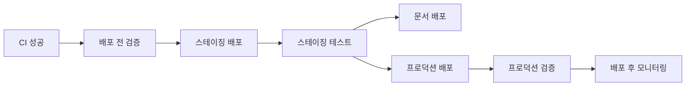
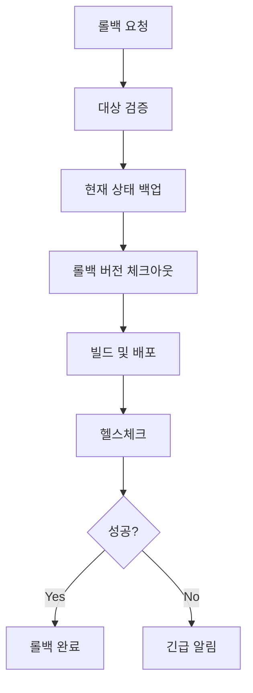

# 🚀 CI/CD 파이프라인 가이드

EAI Schema Toolkit의 CI/CD 파이프라인은 GitHub Actions를 기반으로 구축되어 있으며, 코드 품질 보장부터 자동 배포까지 전체 개발 라이프사이클을 자동화합니다.

## 📋 목차

- [워크플로우 개요](#워크플로우-개요)
- [CI 파이프라인](#ci-파이프라인)
- [보안 스캔](#보안-스캔)
- [배포 파이프라인](#배포-파이프라인)
- [롤백 시스템](#롤백-시스템)
- [릴리즈 관리](#릴리즈-관리)
- [환경 설정](#환경-설정)
- [모니터링](#모니터링)

## 🔄 워크플로우 개요

### 자동 트리거

| 이벤트 | 워크플로우 | 설명 |
|--------|------------|------|
| `push` to `main` | CI, 배포, 릴리즈 | 메인 브랜치 푸시 시 전체 파이프라인 실행 |
| `push` to `develop` | CI | 개발 브랜치 푸시 시 CI만 실행 |
| `pull_request` | CI, 보안 스캔 | PR 생성/업데이트 시 검증 |
| `schedule` (매일 2시) | 보안 스캔 | 정기 보안 스캔 |
| `workflow_dispatch` | 모든 워크플로우 | 수동 실행 |

### 워크플로우 파일

```
.github/workflows/
├── ci.yml          # 지속적 통합
├── security.yml    # 보안 스캔
├── deploy.yml      # 배포 파이프라인
├── rollback.yml    # 롤백 시스템
└── release.yml     # 릴리즈 관리
```

## 🧪 CI 파이프라인

### 1. 코드 품질 검사

```yaml
jobs:
  code-quality:
    - TypeScript 타입 체크
    - ESLint 린팅
    - Prettier 포맷팅 검사
```

**실행 명령어:**
```bash
npm run type-check
npm run lint
npm run format:check
```

### 2. 보안 스캔

```yaml
jobs:
  security-scan:
    - npm audit (의존성 취약점)
    - Snyk 보안 스캔
    - CodeQL 정적 분석
```

### 3. 테스트 실행

#### 단위 테스트
- **환경**: Node.js 20, 22
- **커버리지**: 최소 80%
- **업로드**: Codecov

#### 통합 테스트
- **서비스**: Redis
- **환경**: 테스트 전용 설정

#### E2E 테스트
- **도구**: Playwright
- **브라우저**: Chromium, Firefox, Safari

#### 성능 테스트
- **조건**: main 브랜치 푸시 시만
- **도구**: Jest + Artillery

### 4. 빌드 검증

```yaml
jobs:
  build-verification:
    - 프로덕션 빌드
    - 아티팩트 검증
    - 아티팩트 업로드 (7일 보관)
```

## 🔒 보안 스캔

### 의존성 취약점 스캔

```bash
# npm audit
npm audit --audit-level=moderate

# Snyk 스캔
snyk test --severity-threshold=high
```

### 코드 보안 분석

- **CodeQL**: JavaScript 보안 분석
- **규칙**: security-extended, security-and-quality

### 시크릿 스캔

- **TruffleHog**: 시크릿 패턴 검색
- **GitLeaks**: Git 히스토리 스캔

### 컨테이너 보안 (선택사항)

- **Trivy**: Docker 이미지 취약점 스캔
- **조건**: Dockerfile 존재 시

### 라이센스 컴플라이언스

```bash
# 라이센스 검사
npx license-checker --json

# 금지된 라이센스
GPL-2.0, GPL-3.0, AGPL-1.0, AGPL-3.0
```

### 동적 보안 테스트

- **OWASP ZAP**: 웹 애플리케이션 보안 스캔
- **조건**: 정기 스캔 또는 수동 실행

## 🚀 배포 파이프라인

### 배포 환경

| 환경 | URL | 트리거 | 설명 |
|------|-----|--------|------|
| **스테이징** | `eai-schema-staging.herokuapp.com` | CI 성공 후 | 테스트 환경 |
| **프로덕션** | `eai-schema-api.herokuapp.com` | 스테이징 검증 후 | 운영 환경 |
| **문서** | `yakdoli.github.io/eai-schema` | CI 성공 후 | GitHub Pages |

### 배포 프로세스



### 1. 배포 전 검증

```yaml
pre-deployment-checks:
  - 빌드 테스트
  - 버전 정보 추출
  - 배포 가능 여부 확인
```

### 2. 스테이징 배포

```yaml
deploy-staging:
  environment: staging
  steps:
    - Heroku 배포
    - 헬스체크 (30초 대기)
    - 스모크 테스트
```

### 3. 스테이징 테스트

```yaml
staging-tests:
  - API 엔드포인트 테스트
  - 성능 기준선 테스트
  - 기능 검증
```

### 4. 프로덕션 배포

```yaml
deploy-production:
  environment: production
  steps:
    - Heroku 배포
    - 헬스체크 (60초 대기)
    - 배포 알림
```

### 5. 배포 후 모니터링

```yaml
post-deployment-monitoring:
  - 5분간 헬스체크
  - 성능 메트릭 수집
  - 오류 모니터링
```

## 🔄 롤백 시스템

### 수동 롤백

GitHub Actions에서 수동으로 실행:

1. **Actions** 탭 이동
2. **롤백 시스템** 워크플로우 선택
3. **Run workflow** 클릭
4. 파라미터 입력:
   - **환경**: staging 또는 production
   - **버전**: v1.2.3 또는 커밋 해시
   - **사유**: 롤백 이유

### 스크립트 롤백

```bash
# 스테이징 롤백
./scripts/rollback.sh staging v1.2.3

# 프로덕션 롤백
./scripts/rollback.sh production abc1234
```

### 롤백 프로세스



## 📦 릴리즈 관리

### Semantic Versioning

프로젝트는 [Semantic Versioning](https://semver.org/)을 따릅니다:

- **MAJOR**: 호환되지 않는 API 변경
- **MINOR**: 하위 호환되는 기능 추가
- **PATCH**: 하위 호환되는 버그 수정

### Conventional Commits

커밋 메시지 형식:

```
<type>[optional scope]: <description>

[optional body]

[optional footer(s)]
```

**타입:**
- `feat`: 새로운 기능
- `fix`: 버그 수정
- `docs`: 문서 변경
- `style`: 코드 스타일 변경
- `refactor`: 리팩토링
- `test`: 테스트 추가/수정
- `chore`: 기타 변경

### 자동 릴리즈

```yaml
release:
  triggers:
    - CI 성공 후
    - main 브랜치 푸시
  outputs:
    - GitHub Release
    - 릴리즈 노트
    - 아티팩트 (Linux, Windows, macOS)
    - Docker 이미지 (선택사항)
```

### 릴리즈 아티팩트

| 플랫폼 | 파일 형식 | 설명 |
|--------|-----------|------|
| Linux | `.tar.gz` | Linux x64 바이너리 |
| Windows | `.zip` | Windows x64 바이너리 |
| macOS | `.tar.gz` | macOS x64 바이너리 |

## ⚙️ 환경 설정

### 환경 변수

#### GitHub Secrets

```yaml
# Heroku 배포
HEROKU_API_KEY: "heroku-api-key"

# 보안 스캔
SNYK_TOKEN: "snyk-token"
CODECOV_TOKEN: "codecov-token"

# 알림 (선택사항)
SLACK_WEBHOOK_URL: "slack-webhook-url"
```

#### 환경별 설정 파일

```
.env.ci          # CI/CD 환경
.env.staging     # 스테이징 환경
.env.production  # 프로덕션 환경
```

### Heroku 앱 설정

#### 스테이징

```bash
# 앱 생성
heroku create eai-schema-staging

# 환경 변수 설정
heroku config:set NODE_ENV=staging -a eai-schema-staging
heroku config:set JWT_SECRET=your-jwt-secret -a eai-schema-staging
```

#### 프로덕션

```bash
# 앱 생성
heroku create eai-schema-api

# 환경 변수 설정
heroku config:set NODE_ENV=production -a eai-schema-api
heroku config:set JWT_SECRET=your-jwt-secret -a eai-schema-api
```

## 📊 모니터링

### 헬스체크 엔드포인트

```typescript
// GET /health
{
  "status": "ok",
  "timestamp": "2025-01-01T00:00:00.000Z",
  "uptime": 3600,
  "version": "1.0.0",
  "environment": "production"
}
```

### 메트릭 수집

```typescript
// GET /metrics (Prometheus 형식)
# HELP nodejs_version_info Node.js version info
# TYPE nodejs_version_info gauge
nodejs_version_info{version="v22.0.0",major="22",minor="0",patch="0"} 1

# HELP http_requests_total Total number of HTTP requests
# TYPE http_requests_total counter
http_requests_total{method="GET",status_code="200"} 1234
```

### 알림 시스템

#### 배포 알림

- ✅ 배포 성공
- ❌ 배포 실패
- 🔄 롤백 완료

#### 보안 알림

- 🚨 취약점 발견
- 🔒 보안 스캔 완료
- ⚠️ 라이센스 위반

## 🛠️ 로컬 개발

### CI 명령어 로컬 실행

```bash
# 전체 CI 검증
npm run ci:validate

# 테스트 실행
npm run ci:test

# 빌드
npm run ci:build

# 보안 스캔
npm run security:audit
npm run security:licenses
```

### 배포 스크립트 테스트

```bash
# 스테이징 배포 (로컬)
HEROKU_API_KEY=your-key HEROKU_STAGING_APP=your-app ./scripts/deploy-staging.sh

# 프로덕션 배포 (로컬)
HEROKU_API_KEY=your-key HEROKU_PRODUCTION_APP=your-app ./scripts/deploy-production.sh
```

## 🔧 문제 해결

### 일반적인 문제

#### 1. 빌드 실패

```bash
# 의존성 재설치
rm -rf node_modules package-lock.json
npm install

# 타입 체크
npm run type-check

# 린팅 수정
npm run lint:fix
```

#### 2. 테스트 실패

```bash
# 테스트 캐시 클리어
npm test -- --clearCache

# 특정 테스트 실행
npm test -- --testNamePattern="테스트명"
```

#### 3. 배포 실패

```bash
# Heroku 로그 확인
heroku logs --tail -a your-app-name

# 헬스체크 수동 실행
curl https://your-app.herokuapp.com/health
```

#### 4. 보안 스캔 실패

```bash
# 취약점 수정
npm audit fix

# Snyk 수정
npx snyk wizard
```

### 긴급 상황 대응

#### 프로덕션 장애

1. **즉시 롤백**
   ```bash
   ./scripts/rollback.sh production v1.2.3
   ```

2. **수동 롤백** (GitHub Actions)
   - Actions → 롤백 시스템 → Run workflow

3. **Heroku 직접 롤백**
   ```bash
   heroku rollback -a eai-schema-api
   ```

#### 보안 취약점 발견

1. **즉시 패치**
   ```bash
   npm audit fix --force
   ```

2. **긴급 배포**
   ```bash
   git commit -m "security: fix critical vulnerability"
   git push origin main
   ```

## 📚 추가 자료

- [GitHub Actions 문서](https://docs.github.com/en/actions)
- [Heroku 배포 가이드](https://devcenter.heroku.com/articles/git)
- [Semantic Release 문서](https://semantic-release.gitbook.io/)
- [Conventional Commits](https://www.conventionalcommits.org/)
- [OWASP 보안 가이드](https://owasp.org/www-project-top-ten/)

---

**📞 지원이 필요하신가요?**

- 🐛 [이슈 생성](https://github.com/yakdoli/eai-schema/issues)
- 💬 [토론 참여](https://github.com/yakdoli/eai-schema/discussions)
- 📧 이메일: support@eai-schema.com